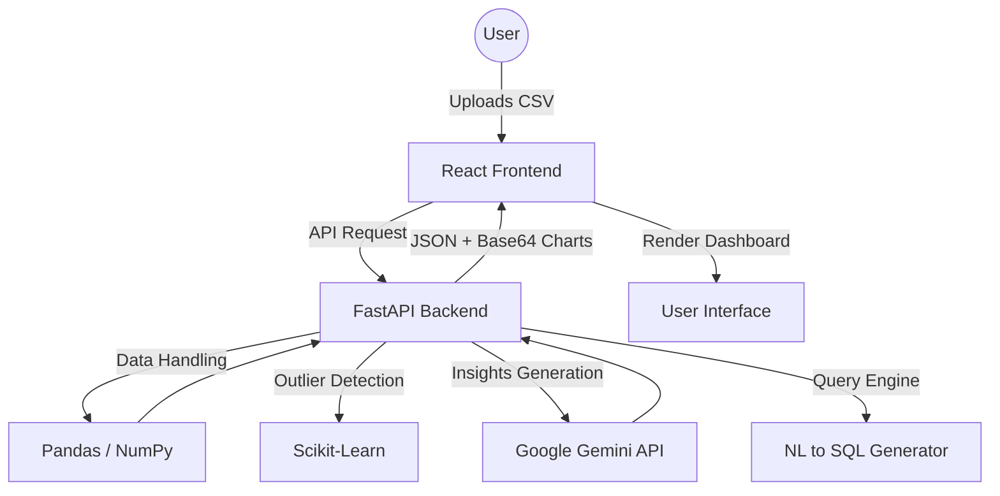

# DataPilot AI

### Navigate Your Data with AI

**DataPilot AI** is a professional, full-stack data analysis platform that transforms raw CSV datasets into actionable business intelligence within seconds. By leveraging the power of **Google Gemini AI** and **Scikit-learn**, it provides automated insights, detects anomalies, and generates manager-friendly summaries, making data science accessible to everyone.


---

## Why This Project?

In many modern organizations, data is abundant, but the time to analyze it is scarce. Business managers often find themselves waiting days for technical teams to provide reports or struggling to interpret complex statistical outputs.

**DataPilot AI** bridges this gap by:
- **Democratizing Data**: Allowing non-technical stakeholders to get instant answers.
- **Speed to Insight**: Reducing analysis time from hours to seconds.
- **Intelligent Discovery**: Automatically flagging outliers that might be missed by manual checks.
- **Narrative Reporting**: Converting numbers into human emotions and business strategies.

---

## Key Highlights (For Recruiters)

- **AI-Native Architecture**: Deep integration with Google Gemini for natural language processing and insight generation.
- **Production-Ready Stack**: Built with a modular FastAPI backend and a responsive, high-performance React frontend.
- **ML-Driven Diagnostics**: Utilizes `IsolationForest` (unsupervised ML) for robust anomaly detection.
- **Dynamic Visualization**: Automated generation of statistical charts using Matplotlib and Seaborn, delivered seamlessly via Base64 encoding.
- **Clean Codebase**: Implements industry-standard design patterns, modular routing, and structured service layers.

---

## Demo

> [!TIP]
> *Coming Soon! Replace these placeholders with your actual project screenshots/GIFs.*

| Dashboard Overview | AI Insights Engine |
| :---: | :---: |
|  |  |

---

## Core Features

- **Instant CSV Ingestion**: High-speed processing of tabular data with automatic schema detection.
- **Automated Statistical Summary**: Instant view of row/column counts, missing values, and data types.
- **AI Insights Engine**: Deep-dive analysis into trends, correlations, and strategic recommendations.
- **Anomaly Detection**: Machine Learning identifies statistical outliers and problematic data points.
- **Manager-Friendly Explanations**: Non-technical "Executive Summaries" for high-level decision-making.
- **NL to SQL**: Convert natural language questions into optimized SQL queries for your dataset.
- **Automated Visualizations**: Beautiful, automated histograms and heatmaps generated on-the-fly.

---

## Tech Stack

### Frontend
- **Framework**: React 18+ (Vite)
- **Styling**: Tailwind CSS
- **Animations**: Framer Motion
- **Icons**: Lucide React
- **State Management**: React Hooks

### Backend
- **Framework**: FastAPI (Python)
- **AI/LLM**: Google Gemini API (`google-generativeai`)
- **Data Engineering**: Pandas, NumPy
- **Machine Learning**: Scikit-learn (IsolationForest)
- **Visualization**: Matplotlib, Seaborn
- **Database**: SQLite (Optional persistence)
- **Environment**: Python Dotenv, Pydantic Settings

---

## Architecture



---

## How It Works

1. **Ingestion**: The user uploads a CSV. The FastAPI backend validates the file and stores it in memory/temporary buffer.
2. **Profiling**: Pandas performs an initial statistical sweep (descriptive stats, missing value counts).
3. **Intelligence**: 
   - Gemini API analyzes the metadata to provide narrative insights.
   - Scikit-learn runs an `IsolationForest` model to flag rows that deviate from the norm.
4. **Presentation**: The React frontend receives a structured JSON payload and renders a dynamic, tabbed workspace with stats, charts, and AI feedback.

---

## Example API Request

### Endpoint: `POST /api/analysis/upload`
**Request (Multipart Form-Data):**
```bash
file=@dataset.csv
```

**Response (JSON):**
```json
{
  "filename": "sales_2024.csv",
  "summary": {
    "rows": 1250,
    "columns": 5,
    "column_names": ["Date", "Product", "Amount", "Region", "Rating"],
    "missing_values": 2,
    "sample_data": [...]
  },
  "insights": "Sales show a significant 15% uptick in the 'East' region during Q2...",
  "explanation": "Basically, our sales are growing, but we need to focus on low-rated regions.",
  "anomalies": [
     {"Date": "2024-03-12", "Amount": 50000, "Region": "West", "Note": "Extreme Outlier"}
  ],
  "charts": ["base64_encoded_string_1", "base64_encoded_string_2"]
}
```

---

## Folder Structure

```text
Data_analyzer/
├── Backend/
│   ├── app/
│   │   ├── main.py          # Entry point
│   │   ├── routers/         # API Endpoints (AI, Analysis)
│   │   ├── services/        # Business logic (LLM, Data processor)
│   │   └── models/          # Pydantic schemas
│   ├── .env                 # Secrets (GEMINI_API_KEY)
│   └── requirements.txt     # Python dependencies
├── Frontend/
│   ├── src/
│   │   ├── components/      # Reusable UI cards & tables
│   │   ├── pages/           # Dashboard logic
│   │   └── services/        # API integration (Axios)
│   ├── tailwind.config.js
│   └── package.json
└── README.md
```

---

## Installation & Setup

### Prerequisites
- Python 3.9+
- Node.js 18+
- [Google Gemini API Key](https://aistudio.google.com/app/apikey)

### Backend Setup
1. Navigate to the backend directory: `cd Backend`
2. Create a virtual environment: `python -m venv venv`
3. Activate it: `source venv/bin/activate` (or `venv\Scripts\activate` on Windows)
4. Install dependencies: `pip install -r requirements.txt`
5. Create a `.env` file and add:
   ```env
   GEMINI_API_KEY=your_api_key_here
   ```
6. Start the server: `uvicorn app.main:app --reload`

### Frontend Setup
1. Navigate to the frontend directory: `cd Frontend`
2. Install packages: `npm install`
3. Start the dev server: `npm run dev`

---

## Future Improvements
- [ ] **Multi-format Support**: Support for Excel, JSON, and Parquet files.
- [ ] **Custom Chat**: A persistent chat sidebar to ask specific questions about charts.
- [ ] **Export Reports**: Generate PDF/Excel summaries of the AI insights.
- [ ] **Auth Integration**: User accounts and project history saving.

---

## Contributing
Contributions are welcome! Please feel free to submit a Pull Request.

1. Fork the Project
2. Create your Feature Branch (`git checkout -b feature/AmazingFeature`)
3. Commit your Changes (`git commit -m 'Add some AmazingFeature'`)
4. Push to the Branch (`git push origin feature/AmazingFeature`)
5. Open a Pull Request

---

## License
Distributed under the MIT License. See `LICENSE` for more information.

---
##  Live Demo
Coming Soon